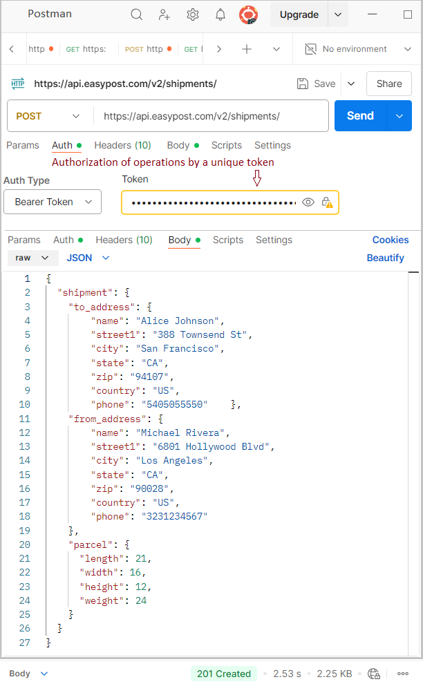
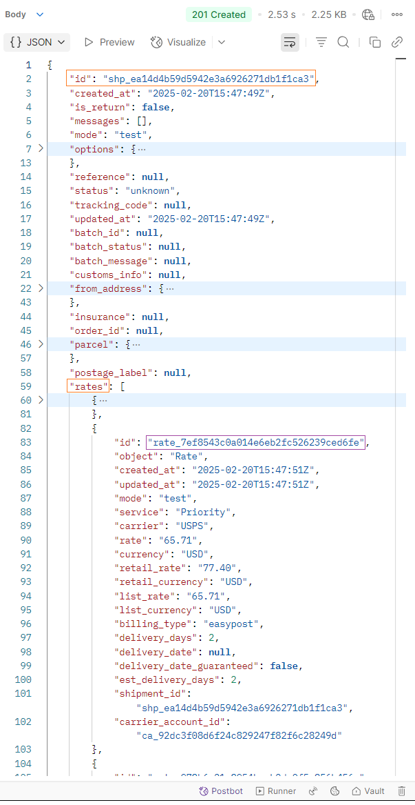
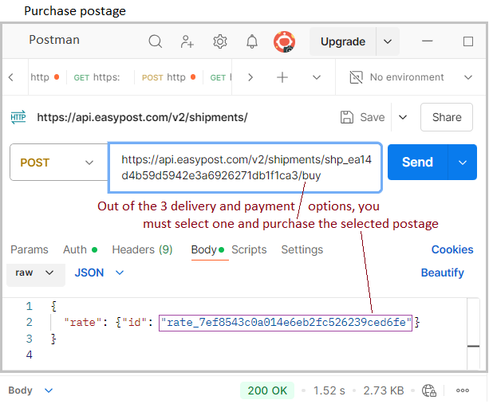
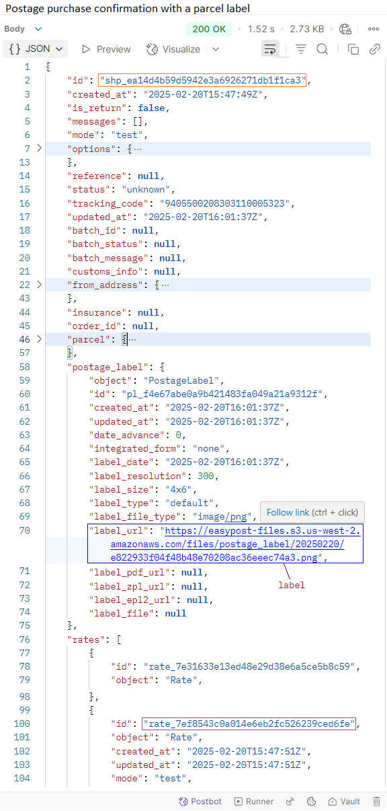
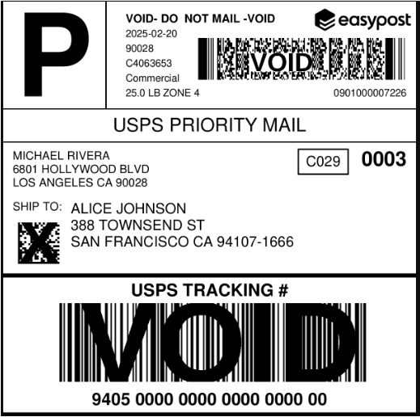
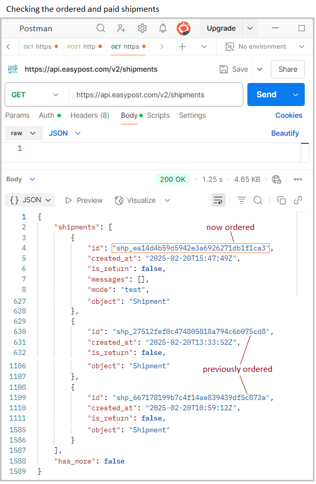

# REST API and Postman

## 🔷 Overview

This project presents how to use the REST API standard to communicate with the advanced EasyPost mail server. Rest API uses the JSON standard and knowing the requirements and message structure expected by EasyPost, you can easily perform advanced actions in EasyPost in text mode, such as ordering a shipment, verifying addresses, viewing payment and delivery options, choosing a carrier or ordering couriers.

## 🔷 Using REST API
The REST API standard is a widely used standard for communication with web servers.
In the REST API Standard, it is relatively easy to implement communication and share complex data. Using only a web browser, you can execute GET commands, but POST commands require more advanced tools.

## 🔷 Software for supporting REST API: Swagger and Postman
The most popular applications for communication via REST API are: Swagger and Postman.
Using Swagger was presented in my previous project (<a href="https://github.com/janluksoft/Node_Express_TS_Rest_Api"><b>AspNet_RestAPI</b></a>).
In this project, I present how to use the Postman application for advanced communication with the EasyPost mail service.

## 🔷 Sample order for shipments in EasyPost
EasyPost is a postal service that allows you to order postal shipments, pay for them and call a courier. To use EasyPost, you must register as a user - then you receive a unique token, which is a secure identifier for communication with the REST API of the service that provides such an interface.

The project presents a shipment order from Los Angeles to San Francisco.

1) A shipment must be created. To do this, the address "https://api.easypost.com/v2/shipments" is entered in the POST method, and all operations are authorized in Auth by entering your token. JSON is entered in Body with the data of the sender, recipient, and package parameters, as shown in Fig.1. In response, we receive confirmation of generating a pre-order (id="shp_ea14d4b59d5942e3a6926271db1f1ca3"), which also includes 3 payment options (Fig.2).

2) From the 3 delivery and payment options, select one and purchase the selected postage (Fig.3). The shipment ID, "Buy" action, and payment ID are provided: "id": "rate_7ef8543c0a014e6eb2fc526239ced6fe". In response, we receive JSON with a lot of data about the paid shipment. Among other things, there is a link to a label that should be printed and stuck to the package (Fig.5).

3) only now is the shipment order active and appears in the list of shipments (Fig.6). This can be checked by using the command: GET: //api.easypost.com/v2/shipments.

4) on the ordered shipment, you can perform further operations via REST API, e.g. Activate the courier order, which will confirm its arrival within a specified time period.

## 🔷 Interface with Open API
EasyPost provides the user with an extensive REST API communication interface. Using it via the Postman application has been presented above. It is possible, but as you can see, it is very troublesome, copying IDs and other advanced parameters can lead to errors.

Therefore, a better way is to use the Open API standard, obtain a set of classes for secure communication with the EasyPost REST API and use them in your software supporting the entire shipment system.

## 🔷 Azure Functions
Another interesting option is to build a method/software fragment as Azure/Functions, which method, for example, will start at 3:00 p.m., check the number of orders, their correctness, and automatically call the courier for these shipments;
In one of the next projects, such an option will be presented.

## 🔷 Summary
REST API is a friendly standard for communicating over the Internet. You can especially test Swagger and Postman programs, which show the data sent in both directions very well.
For professional use of REST API, however, it is better to use the Open API standard and obtain a set of classes for safe and easy communication.

---
